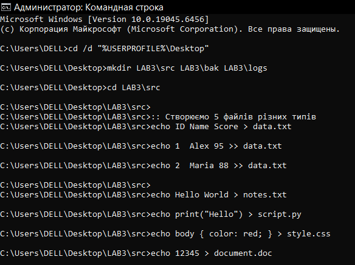
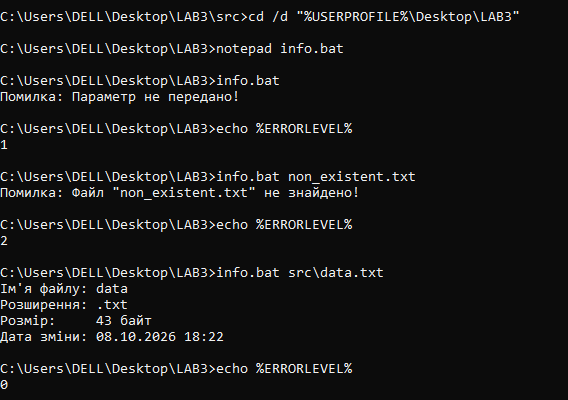
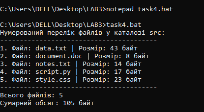
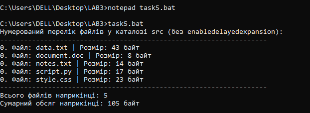
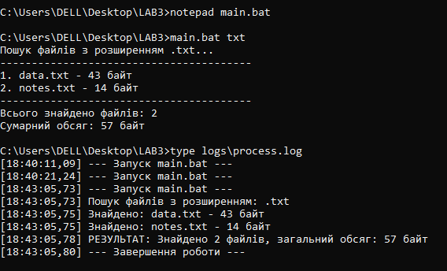
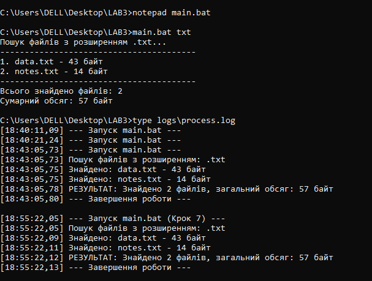
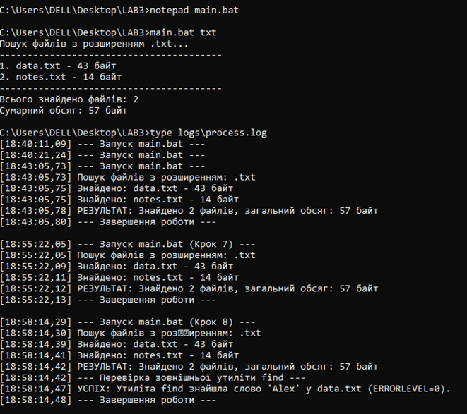
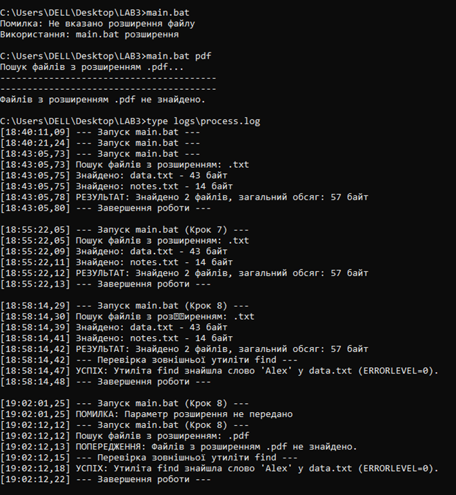

<!--
  Командні файли в ОС Windows
  Варіант 2: Пошук файлів за розширенням і запис переліку у звіт — розширення — Порахувати сумарний обсяг знайдених файлів

  Тему, мету й обладнання писати не треба — конвеєр візьме їх із лабораторної.
  Знімки екрана кладіть у assets/, вихідний код — у src/.
  Контрольні питання — лише одного рівня, того, на який захищаєте роботу:
  заголовок «### Достатній рівень», далі «1 Текст питання?» і відповідь.
  Покрокова інструкція — reports/README.md
-->

## Хід роботи

1. **Отримання варіанта:** Отримала у викладача індивідуальний варіант №2.

2. **Створення структури каталогів та файлів:** На робочому столі створила каталог `LAB3` із трьома підкаталогами: `src`, `bak` та `logs`. Перейшла у каталог `src` та наповнила його 5 файлами різних типів, включаючи текстовий файл із даними у стовпцях. В результаті у папці `LAB3\src` створила файли: `data.txt`, `notes.txt`, `script.py`, `style.css` та `document.doc`.

3. **Скрипт перевірки файлу (`info.bat`):** У каталозі `LAB3` створила скрипт `info.bat`, який приймає ім'я файлу параметром, перевіряє його існування та виводить детальні відомості. Для обробки виняткових ситуацій передбачила відповідні коди повернення (`exit /b`).

4. **Скрипт підрахунку файлів з відкладеним розгортанням (`task4.bat`):** Написала скрипт `task4.bat`, який обходить каталог `src` циклом `for`, обчислює кількість файлів, їхній сумарний обсяг та виводить нумерований список, використовуючи режим `enabledelayedexpansion`.

5. **Аналіз синтаксису розгортання змінних (`task5.bat`):** Написала скрипт `task5.bat`, у якому вилучила інструкцію `setlocal enabledelayedexpansion` та змінила синтаксис звернення до змінних всередині циклу з `!count!` на `%count%`.

   * **Пояснення поведінки лічильника:**
     * Інтерпретатор командного рядка CMD працює за принципом поскриптового розгортання блоків коду. Коли CMD зчитує складну конструкцію (наприклад, цикл `for (...)`), він виконує синтаксичний аналіз (парсинг) усього блоку циклу одразу ще до його запуску.
     * На етапі цього попереднього аналізу всі змінні у форматі `%var%` замінюються на ті значення, які вони мали до входу в блок. Оскільки змінна `%count%` перед циклом дорівнювала `0`, інтерпретатор підставив `0` в команду `echo %count%.` для всіх ітерацій наперед.
     * Команда `set /a count+=1` фактично змінювала значення змінної в пам'яті під час кожної ітерації, але підставлений шаблон `echo 0.` вже не оновлювався.
     * Після виходу з блоку циклу наступна окрема команда `echo %count%` вже зчитувала актуальний стан пам’яті, тому вивела `5`.
     * Режим `enabledelayedexpansion` із синтаксисом `!var!` змушує інтерпретатор обчислювати значення змінної безпосередньо в момент виконання кожної окремої ітерації, що й забезпечує правильне відображення динамічних лічильників.
6. **Основний скрипт фільтрації та логування (`main.bat`):** Створила файл `main.bat`. Скрипт приймає розширення файлу параметром (наприклад, `txt`), перевіряє факт передачі параметра, обходить каталог `src` циклом `for`, відбираючи лише файли з вказаним розширенням, та занотовує перелік і результати обробки у журнал `logs\process.log`.
     

     
7. **Рефакторинг логування через підпрограми:** Для оптимізації коду та уникнення дублювання операцій перенаправлення потоку винесла запис у лог-файл в окрему підпрограму `:log`. Виклики виконувала за допомогою команди `call :log "повідомлення"`. Підпрограма автоматично додавала поточний час `[%time%]` до кожного запису.

     
8. **Інтеграція утиліти `find` та обробка %ERRORLEVEL%:** Додала до скрипта `main.bat` виклик системної утиліти `find`, яка виконувала пошук рядка `"Alex"` у файлі `src\data.txt`. За допомогою перевірки значення `%ERRORLEVEL%` після виклику утиліти організувала запис у журнал відповідного статусу (успіх або помилка).

     
9. **Тестування та аналіз логів:** Запустила скрипт `main.bat` у кількох режимах та зафіксувала створений зміст файлу `logs\process.log`:
   * Коректний запуск: `main.bat txt`
   * Хибний запуск без параметра: `main.bat`
   * Хибний запуск з неіснуючим розширенням: `main.bat pdf`

10. **Додаткове завдання (обчислення сумарного обсягу):** Реалізувала всередині циклу `for` основного скрипта `main.bat`. За допомогою накопичувача `set /a total_size+=%%~zF` скрипт визначив розмір усіх виявлених `.txt` файлів (`data.txt` — 43 байти, `notes.txt` — 14 байт) та вивів підсумковий сумарний обсяг у консоль і журнал: 57 байт.

## Відповіді на контрольні питання

### Високий рівень (творчий)

1. **Скрипт правильно обробляє файли в циклі `for`, але нумерація у виводі всередині циклу показує самі нулі, а підсумок після циклу правильний. Поясніть обидва факти через порядок розбору блоку й запропонуйте два різні способи виправлення.**
   * **Пояснення:** Командний інтерпретатор CMD виконує синтаксичний аналіз (парсинг) усього блоку циклу `for (...)` одноразово ще до початку його фактичного виконання. Під час цього попереднього аналізу всі змінні у форматі `%count%` одразу замінюються на те значення, яке вони мали безпосередньо перед входом у цикл, тобто на нуль. Хоча команда `set /a count+=1` успішно змінює значення змінної в пам'яті під час кожної ітерації, команда `echo %count%` вже розібрана як `echo 0`, тому не оновлюється під час руху циклом. Натомість підсумковий рядок `echo %count%` розміщений поза блоком циклу і піддається аналізу вже після його завершення. У цей момент інтерпретатор зчитує з пам'яті вже актуальний стан змінної, що й пояснює правильний фінальний результат.
   * **Способи виправлення:**
     * *Увімкнення відкладеного розгортання змінних:* Додати на початку скрипта команду `setlocal enabledelayedexpansion` та звертатися до змінної через знаки оклику `!count!`, що змушує CMD обчислювати її значення безпосередньо в момент виконання кожної окремої ітерації.
     * *Винесення тіла циклу у підпрограму:* Перенести команди обробки в окремий блок і викликати його через `call :subroutine`, оскільки виклик підпрограми змушує CMD повторно виконувати синтаксичний аналіз команд при кожному зверненні без увімкнення розширеного режиму.

2. **Потрібно щоночі копіювати робочий каталог, зберігати п’ять останніх копій і видаляти старіші. Опишіть структуру скрипта: які перевірки, який цикл, які коди повернення.**
   * **Перевірки та створення копії:** Структура скрипта щонічного резервного копіювання починається з підготовчих перевірок, де спочатку перевіряється існування вихідного каталогу за допомогою умовної конструкції `if not exist "%SOURCE%" exit /b 1`, а потім аналізується наявність папки призначення для бекапів з її автоматичним створенням у разі відсутності. Для створення нової копії формується унікальна назва каталогу на основі поточної дати, після чого виконується копіювання вмісту системною утилітою `robocopy "%SOURCE%" "%BACKUP_DIR%\backup_%TODAY%" /E`.
   * **Цикл очищення:** Очищення застарілих даних реалізується через цикл `for /f`, який аналізує вивід команди `dir "%BACKUP_DIR%\backup_*" /b /o-d /ad`. Ця команда сортує наявні архивні папки за датою створення у зворотному порядку. Параметр `skip=5` у циклі дозволяє пропустити перші п'ять найновіших копій, а всі старіші папки, що залишилися, вилучаються командою `rmdir /s /q`.
   * **Коди повернення:** Наприкінці скрипт повертає коди `exit /b`: значення `0` означає успішне завершення, `1` — відсутність вихідного каталогу, `2` — помилку копіювання через `robocopy` (`ERRORLEVEL >= 8`), а код `3` свідчить про збій під час видалення застарілих бекапів.

3. **Скрипт працює, коли його запускають подвійним клацанням, і не працює, коли він викликається з планувальника завдань. Назвіть щонайменше три ймовірні причини й спосіб перевірки кожної.**
   1. *Некоректний робочий каталог:* При ручному запуску подвійним клацанням робочим каталогом за замовчуванням є папка зі скриптом, тоді як Планувальник завдань запускає процес із системної директорії `C:\Windows\System32`, через що всі відносні шляхи перестають працювати. **Перевірка:** записати поточний каталог у лог-файл командою `echo %cd% >> debug.log` або відразу додати на початку скрипта команду переходу до власної папки `cd /d "%~dp0"`.
   2. *Різниця в контексті облікового запису та правах доступу:* Ручний запуск відбувається від імені інтерактивного користувача з його мережевими дисками та правами, тоді як Планувальник може виконувати завдання під службовим обліковим записом `SYSTEM`. **Перевірка:** перевірити параметри завдання в Планувальнику (опція «Run with highest privileges») або використовувати утиліти для тестування скрипта в контексті `SYSTEM`.
   3. *Наявність інтерактивних команд:* Команди на кшталт `pause` або запити підтвердження операцій (`y/n`). Оскільки фонова задача в Планувальнику не має графічного інтерфейсу користувача, скрипт безкінечно чекає на введення даних. **Перевірка:** перенаправити весь вивід помилок у файл під час виклику з планувальника через `cmd.exe /c "script.bat > log.txt 2>&1"` та проаналізувати зафіксований лог.

4. **Сформулюйте критерій, за яким задачу варто розв’язувати пакетним файлом, а коли переходити на PowerShell. Обґрунтуйте прикладом із цієї роботи.**
   * **Критерій вибору:** Головним критерієм вибору є складність логіки та тип даних, з якими працює скрипт. Пакетні файли (`.bat`) ідеально підходять для простих, лінійних системних завдань — виклику послідовності готових утиліт, базового переміщення чи копіювання файлів, де важлива миттєва готовність на будь-якій системі Windows без налаштування політики виконання скриптів. Переходити на PowerShell необхідно тоді, коли задача вимагає об'єктної обробки даних, роботи з масивами, глибокої аналітики структурованих форматів (JSON, XML), надійної обробки винятків (`try/catch`) або складних математичних розрахунків.
   * **Обґрунтування прикладом:** Наочним обґрунтуванням з цієї лабораторної роботи є обчислення сумарного обсягу та кількості файлів у Кроках 4 і 5. У пакетному файлі CMD для реалізації цієї задачі довелося вмикати режим `enabledelayedexpansion`, стежити за специфікою синтаксичного аналізу блоків коду та застосовувати накопичувальні лічильники `set /a`. Натомість у PowerShell ця сама задача зводиться до одного надійного та читабельного рядка `Get-ChildItem .\src | Measure-Object -Property Length -Sum`, де розмір і кількість файлів обробляються як природні властивості об'єктів.

## Висновок

Під час виконання лабораторної роботи я засвоїла синтаксис та базові принципи створення пакетних файлів (Batch scripts) в операційній системі Windows. Ознайомилася з механізмом передачі параметрів командного рядка, аналізом кодів повернення `%ERRORLEVEL%`, реалізацією підпрограм та засобів логування. Особливу увагу приділила специфіці обробки змінних всередині циклів та розграниченню звичайного і відкладеного розгортання змінних (`enabledelayedexpansion`).

**Обґрунтування щодо вибору засобів автоматизації:**

* **Задачі, які доцільно автоматизувати пакетними файлами (CMD / Batch):**
  * Прості, повсякденні рутинні операції над файловою системою (створення структури каталогів, примітивне копіювання, переміщення, очищення папок).
  * Запуск послідовності готових утиліт чи програм без складної математичної чи об'єктної обробки.
  * Скрипти, які повинні гарантовано виконуватися на будь-якій системі Windows без додаткових налаштувань прав доступу або запусків спеціальних середовищ.

* **Випадки, коли необхідне використання PowerShell:**
  * Складні завдання адміністрування ОС, робота зі службами, реєстром, мережевими протоколами, Active Directory.
  * Необхідність глибокої обробки структурованих даних (JSON, XML, CSV) та робота з об'єктами .NET замість простого тексту.
  * Потреба у надійній обробці винятків (конструкції `try/catch/finally`), роботі з масивами та розширеними математичними розрахунками.
  * Задачі, де використання CMD стає громіздким через обмеження синтаксису (як-от проблеми з кодуванням, відсутність повноцінних типів даних та складність обробки рядків).

