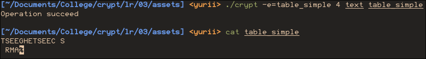
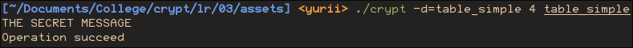
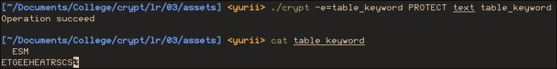
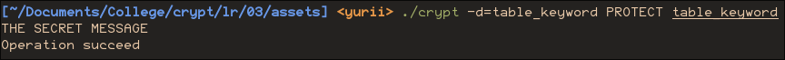
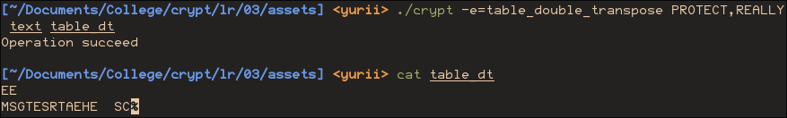
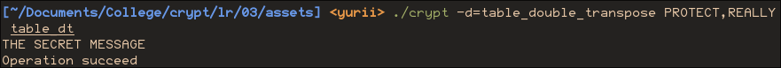

## Хід роботи

1 Отримати в викладача номер індивідуального варіанта.

| № | Ключове слово | Текст для шифрування |
|---|---------------|----------------------|
| 5 | PROTECT       | THE SECRET MESSAGE   |

2 Реалізувати просту шифруючу таблицю (запис по рядках, читання по стовпцях).

src/algorithms/table_simple.zig

```zig 
//! Write by rows, read by cols
const std = @import("std");
const Io = std.Io;
const opts = @import("options.zig");

pub fn encrypt(key_str: []const u8, source: []const u21, sink: *Io.Writer) Io.Writer.Error!bool {
    const cols = getKey(key_str) orelse return false;
    const rows = @divFloor(source.len + cols - 1, cols);

    // Treat source like 2d array with width "cols"
    for (0..cols) |col_i| {
        for (0..rows) |row_i| {
            const idx = row_i * cols + col_i;

            const crypted = if (idx < source.len)
                source[idx]
            else
                opts.padding_cp;

            try sink.print("{u}", .{crypted});
        }
    }
    return true;
}

pub fn decrypt(key_str: []const u8, source: []const u21, sink: *Io.Writer) Io.Writer.Error!bool {
    const rows = getKey(key_str) orelse return false;
    const cols = @divFloor(source.len + rows - 1, rows);

    for (0..cols) |col_i| {
        for (0..rows) |row_i| {
            const idx = row_i * cols + col_i;
            const plain = source[idx];
            if (plain != opts.padding_cp) {
                try sink.print("{u}", .{plain});
            }
        }
    }

    return true;
}

fn getKey(key_str: []const u8) ?u8 {
    const key: u8 = std.fmt.parseInt(u8, key_str, 10) catch {
        std.debug.print("Key needs to be a number\n", .{});
        return null;
    };
    if (key == 0) {
        std.debug.print("Table width can not be zero\n", .{});
        return null;
    }
    return key;
}
```

3 Реалізувати функцію визначення порядку за ключовим словом.

src/algorithms/table_keyword.zig

```zig
pub fn getKey(key_str: []const u8) ?Key {
    var key_view = std.unicode.Utf8View.init(key_str) catch {
        std.debug.print("Key is not a valid text\n", .{});
        return null;
    };
    var it = key_view.iterator();

    var keyword: [key_max_len]u21 = undefined;
    var len: usize = 0;
    while (it.nextCodepoint()) |cp| {
        if (len >= key_max_len) {
            std.debug.print("Key length is limited to {}\n", .{key_max_len});
            return null;
        }
        keyword[len] = cp;
        len += 1;
    }

    if (len < 2) {
        std.debug.print("Keyword must be at least 2 characters long", .{});
        return null;
    }

    // THERE
    std.debug.print("Keyword:", .{});
    for (keyword[0..len]) |l| std.debug.print(" {u}", .{l});

    var key: [key_max_len]usize = undefined;
    for (0..len) |i| {
        const min_i = std.mem.findMin(u21, keyword[0..len]);
        key[min_i] = i;
        keyword[min_i] = std.math.maxInt(u21);
    }

    // AND THERE
    std.debug.print("\nOrder:  ", .{});
    for (key[0..len]) |o| std.debug.print(" {}", .{o});
    std.debug.print("\n", .{});

    return .{key, len};
}
```


4 Реалізувати шифрування та дешифрування з ключовим словом.

src/algorithms/table_keyword.zig

```zig
//! Keyword letters order determine columns writting/reading order
const std = @import("std");
const Io = std.Io;
const opts = @import("options.zig");

pub fn encrypt(key_str: []const u8, source: []const u21, sink: *Io.Writer) Io.Writer.Error!bool {
    const order, const cols = getKey(key_str) orelse return false;
    const cols_order = order[0..cols];

    const rows = @divFloor(source.len + cols - 1, cols);

    for (cols_order) |col_i| {
        for (0..rows) |row_i| {
            const idx = row_i * cols + col_i;

            const crypted = if (idx < source.len) source[idx]
                            else opts.padding_cp;

            try sink.print("{u}", .{crypted});
        }
    }
    return true;
}

pub fn decrypt(key_str: []const u8, source: []const u21, sink: *Io.Writer) Io.Writer.Error!bool {
    const order, const rows = getDecrKey(key_str) orelse return false;
    const rows_order = order[0..rows];

    const cols = @divFloor(source.len + rows - 1, rows);

    for (0..cols) |col_i| {
        for (rows_order) |row_i| {
            const idx = row_i * cols + col_i;
            const plain = source[idx];
            if (plain != opts.padding_cp) {
                try sink.print("{u}", .{plain});
            }
        }
    }

    return true;
}

pub const key_max_len = 30;
pub const Key = struct{[key_max_len]usize, usize};

pub fn getKey(key_str: []const u8) ?Key {
    var key_view = std.unicode.Utf8View.init(key_str) catch {
        std.debug.print("Key is not a valid text\n", .{});
        return null;
    };
    var it = key_view.iterator();

    // Convert to unicode
    var keyword: [key_max_len]u21 = undefined;
    var len: usize = 0;
    while (it.nextCodepoint()) |cp| {
        if (len >= key_max_len) {
            std.debug.print("Key length is limited to {}\n", .{key_max_len});
            return null;
        }
        keyword[len] = cp;
        len += 1;
    }

    if (len < 2) {
        std.debug.print("Keyword must be at least 2 characters long", .{});
        return null;
    }

    // Reduce letters alphabetic number to relative alphabetic order
    var key: [key_max_len]usize = undefined;
    for (0..len) |i| {
        const min_i = std.mem.findMin(u21, keyword[0..len]);
        key[min_i] = i;
        keyword[min_i] = std.math.maxInt(u21);
    }

    return .{key, len};
}

pub fn getDecrKey(key_str: []const u8) ?Key {
    const enc_key, const len = getKey(key_str) orelse return null;
    var key: [key_max_len]usize = undefined;

    for (0..len) |i| {
        key[enc_key[i]] = i;
    }

    return .{key, len};
}
```


5 Реалізувати подвійну перестановку.

src/algorithms/table_double_transpose.zig

```zig
//! Like table_keyword but with second keyword for rows
//! Key format: <rows_key>,<cols_key>
const std = @import("std");
const Io = std.Io;
const opts = @import("options.zig");
const tbkw = @import("table_keyword.zig");

pub fn encrypt(key_str: []const u8, source: []const u21, sink: *Io.Writer) Io.Writer.Error!bool {
    return crypt(false, key_str, source, sink);
}
pub fn decrypt(key_str: []const u8, source: []const u21, sink: *Io.Writer) Io.Writer.Error!bool {
    return crypt(true, key_str, source, sink);
}

pub fn crypt(to_decrypt: bool, key_str: []const u8, source: []const u21, sink: *Io.Writer) Io.Writer.Error!bool {
    const key = getKey(key_str, to_decrypt) orelse return false;
    const rows_order = key.row.@"0"[0..key.row.@"1"];
    const cols_order = key.col.@"0"[0..key.col.@"1"];

    const iter_len = rows_order.len * cols_order.len;

    for (0..@divFloor(source.len + iter_len - 1, iter_len)) |i| {
        for (cols_order) |col_i| {
            for (rows_order) |row_i| {
                const idx = i * iter_len + row_i * cols_order.len + col_i;
                if (to_decrypt) {
                    const plain = source[idx];
                    if (plain != opts.padding_cp) {
                        try sink.print("{u}", .{plain});
                    }
                } else {
                    const crypted = if (idx < source.len) source[idx]
                    else opts.padding_cp;
                    try sink.print("{u}", .{crypted});
                }
            }
        }
    }
    return true;
}


const Key = struct{row: tbkw.Key, col: tbkw.Key};

fn getKey(key_str: []const u8, to_decrypt: bool) ?Key {
    const sep_i = std.mem.findScalar(u8, key_str, ',') orelse {
        std.debug.print("Key must be in format '<rows_keyword>;<columns_keyword>'\n", .{});
        return null;
    };
    const row_key, const col_key = if (to_decrypt)
        .{tbkw.getKey(key_str[0..sep_i]),
          tbkw.getKey(key_str[sep_i+1..])}
    else
        .{tbkw.getDecrKey(key_str[sep_i+1..]),
          tbkw.getDecrKey(key_str[0..sep_i])};


    return .{
        .row = row_key orelse return null,
        .col = col_key orelse return null,
    };
}
```

6 Виконати шифрування тексту з варіанта.

Вихідний текст знаходиться у файлі `text`













7 Оформити звіт та зробити висновок.

## Відповіді на контрольні питання

Високий рівень (творчий)

1. Запропонуйте алгоритм автоматичного зламу шифру простої перестановки за наявності достатнього обсягу шифротексту.

   Для автоматичного зламу потрібен автоматичний метод верифікації правильності декодування.
   
   Для цього можна використовувати словник (наприклад hunspell),
   який буде перевіряти кількість коректних слов у тексті,
   і потрібно буде вибрати розшифровку із найбільшою кількість вірних слів.
   
   Також можна аналізувати кількість неможливих та частих бі/триграм у тексті,
   обираючи ключ із найкращим коефіцієнтом.
   

2. Поясніть, чому комбінація заміни й перестановки стійкіша за кожен із цих методів окремо, і наведіть приклад такої комбінації в сучасних шифрах.

   Головна слабкість заміни - частотний аналіз, перестановки - бі та триграми.
   При об'єднанні шифр заміни порушує бі та три грами, а шифр престановки зберігає частоти символів.
   Тобто разом ці два підходи закривають недоліки один одного.
   
   Приклади у сучасних шифрах: 
   - AES: переставляє байти всередені блоків які замінюються по спец. таблиці.
   - DES: переставляє дані у блоках по 64 біти, а потім 16 разів дані змінюються та підставляються
     і йде ще одна перестановка блоків

3. Оцініть реальну стійкість подвійної перестановки з ключами довжиною 8 і 10 символів: скільки варіантів має перебрати криптоаналітик?

   Для англійського алфавіту без урахування регістру:
   A(8, 26) * A(10, 26) = 1 × 10^42 = 1 tredecillion варіантів.

4. Сформулюйте, які властивості тексту зберігає шифр перестановки, і поясніть, як саме ці властивості використовує криптоаналітик.

   Шифр перестановки зберігає частотні характеристики символів: 
   частоти символів, індекс інцедентності, довжина тексту
   
   Криптоаналітик може:
   - зрозумти чи текст є осмисленим за індексом інцедентності;
   - визначити мову за частотою символів (а може і специфіку тексту якщо розподіл частот незвичайний);
   - знайти розмір ключа (ширину таблиці підстановки чи блоку в середені якого йшла перестановка)
     за закономірностями у тексті (бі/триграми);

## Висновок

Я реалізував шифрування та дешифрування тексту за допомогою таблиць перестановки,
зрозумів практично принцип даного класу алгоритмів шифрування
