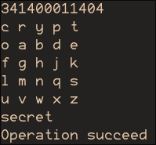
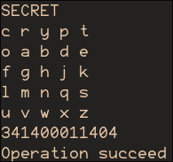
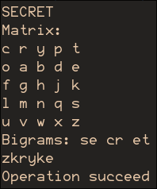
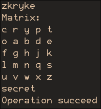
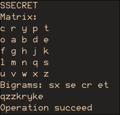
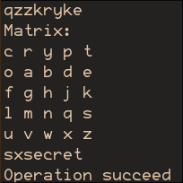
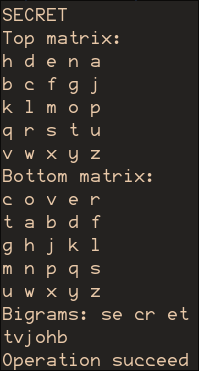
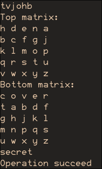
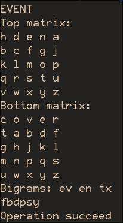
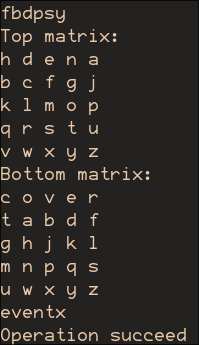

<!--
  Шифр Плейфера. Подвійний квадрат
  Варіант 5: CRYPTO — HIDDEN — COVERT — SECRET

  Тему, мету й обладнання писати не треба — конвеєр візьме їх із лабораторної.
  Знімки екрана кладіть у assets/, вихідний код — у src/.
  Контрольні питання — лише одного рівня, того, на який захищаєте роботу:
  заголовок «### Достатній рівень», далі «1 Текст питання?» і відповідь.
  Покрокова інструкція — reports/README.md
-->

## Хід роботи

1. Отримати в викладача номер індивідуального варіанта.

1. Реалізувати функцію побудови матриці 5×5 за ключовим словом.

   ```zig
   pub fn makeMatrix(keyword: []const u8) ?[25]u21 {
       var moved: [26]bool = @splat(false);
       var key: [26]u21 = undefined;
       var key_i: usize = 0;
   
       // Move unique letters from input key to the beginning of key
       for (keyword) |cp| {
           const ch = getLetter(cp) orelse {
               std.debug.print("Key character {u} is not acceptable as key\n", .{cp});
               return null;
           };
           const i = ch - 'a';
           if (!moved[i]) {
               moved[i] = true;
               key[key_i] = ch;
               key_i += 1;
           }
       }
       // Add rest of letters
       for ('a'..'z'+1) |cp| {
           const ch: u8 = @intCast(cp);
           const i = ch - 'a';
           if (!moved[i]) {
               key[key_i] = ch;
               key_i += 1;
           }
       }
       // Merge i and j
       var merged_key: [25]u21 = undefined;
       var found_i: bool = false;
       for ('a'..'z'+1) |i| {
           if (key[i-'a'] == 'i') {
               found_i = true;
               continue;
           }
           merged_key[i-'a'-@intFromBool(found_i)] = key[i-'a'];
       }
   
       return merged_key;
   }
   ```

1. Реалізувати підготовку тексту (видалення пробілів, обробка повторів).

   Виконується у потоці під час шифрування

1. Реалізувати шифрування та дешифрування однієї біграми.

   Для шифру Плейфера (mat - підготовлена матриця шифрування за ключовим словом):
   
   ```zig
   if (y1 == y2) { // Same row
       crypted[0] = mat[y1*5 + (x1+1) % 5];
       crypted[1] = mat[y2*5 + (x2+1) % 5];
   } else if (x1 == x2) { // Same column
       crypted[0] = mat[((y1+1)%5)*5 + x1];
       crypted[1] = mat[((y2+1)%5)*5 + x2];
   } else { // Rectangle
       crypted[0] = mat[y1*5 + x2];
       crypted[1] = mat[y2*5 + x1];
   }
   try sink.print("{u}{u}", .{crypted[0], crypted[1]});
   ```

   Для шифру Уітстона (top, bottom - верхня та нижня матриці шифрування):
   
   ```zig
   var crypted: [2]u21 = undefined;
   if (x1 == x2) { // Same column
       crypted[0] = top[((y1+1)%5)*5 + x1];
       crypted[1] = bottom[((y2+1)%5)*5 + x2];
   } else { // Rectangle
       crypted[0] = top[y1*5 + x2];
       crypted[1] = bottom[y2*5 + x1];
   }
   try sink.print("{u}{u}", .{crypted[0], crypted[1]});
   ```

1. Реалізувати повний шифр Плейфера.

   ```zig
   const std = @import("std");
   const Io = std.Io;
   const opts = @import("options.zig");
   const mutil = @import("matrix_cyphers_util.zig");
   
   pub fn encrypt(key_str: []const u8, source: []const u21, sink: *Io.Writer) Io.Writer.Error!bool {
       const mat = getKey(key_str) orelse return false;
   
       std.debug.print("Bigrams: ", .{});
       var it: mutil.BigramIter = .init(source, true);
       while (it.next()) |bigram| {
           std.debug.print("{u}{u} ", .{bigram[0], bigram[1]});
   
           const y1, const x1 = mutil.matrixYX(&mat, bigram[0]) orelse unreachable; // Ensured in iterator
           const y2, const x2 = mutil.matrixYX(&mat, bigram[1]) orelse unreachable;
           std.debug.assert(y1 != y2 or x1 != x2);
   
           var crypted: [2]u21 = undefined;
           if (y1 == y2) { // Same row
               crypted[0] = mat[y1*5 + (x1+1) % 5];
               crypted[1] = mat[y2*5 + (x2+1) % 5];
           } else if (x1 == x2) { // Same column
               crypted[0] = mat[((y1+1)%5)*5 + x1];
               crypted[1] = mat[((y2+1)%5)*5 + x2];
           } else { // Rectangle
               crypted[0] = mat[y1*5 + x2];
               crypted[1] = mat[y2*5 + x1];
           }
           try sink.print("{u}{u}", .{crypted[0], crypted[1]});
       }
       std.debug.print("\n", .{});
   
       return true;
   }
   
   pub fn decrypt(key_str: []const u8, source: []const u21, sink: *Io.Writer) Io.Writer.Error!bool {
       var src = source;
       while (src[src.len - 1] == '\n' or src[src.len - 1] == ' ') src = src[0..src.len-1];
       if (src.len % 2 != 0) {
           std.debug.print("Text length is not even\n", .{});
           return false;
       }
   
       const mat = getKey(key_str) orelse return false;
       for (0..src.len/2) |i| {
           const ch1 = src[i*2];
           const ch2 = src[i*2+1];
   
           // Check for text to be really playfair encrypted
           const y1, const x1 = mutil.matrixYX(&mat, ch1) orelse {
               std.debug.print("Character {u} not in the table\n", .{ch1});
               return false;
           };
           const y2, const x2 = mutil.matrixYX(&mat, ch2) orelse {
               std.debug.print("Character {u} not in the table\n", .{ch2});
               return false;
           };
           if (y1 == y2 and x1 == x2) {
               std.debug.print("Pair consists of same characters\n", .{});
               return false;
           }
   
           var plain: [2]u21 = undefined;
           if (y1 == y2) { // Same row
               plain[0] = mat[y1*5 + @as(u16, @intCast(@mod(@as(i32, x1) - 1, 5)))];
               plain[1] = mat[y2*5 + @as(u16, @intCast(@mod(@as(i32, x2) - 1, 5)))];
           } else if (x1 == x2) { // Same column
               plain[0] = mat[@as(u16, @intCast(@mod(@as(i32, y1) - 1, 5)))*5 + x1];
               plain[1] = mat[@as(u16, @intCast(@mod(@as(i32, y2) - 1, 5)))*5 + x2];
           } else { // Rectangle
               plain[0] = mat[y1*5 + x2];
               plain[1] = mat[y2*5 + x1];
           }
           try sink.print("{u}{u}", .{plain[0], plain[1]});
       }
       return true;
   }
   
   pub fn getKey(key_str: []const u8) ?[25]u21 {
       const mat = mutil.makeMatrix(key_str) orelse return null;
       std.debug.print("Matrix:\n", .{});
       mutil.printMatrix(&mat);
       return mat;
   }
   ```
   

1. Реалізувати подвійний квадрат Уітстона.
   
   ```zig
   const std = @import("std");
   const Io = std.Io;
   const opts = @import("options.zig");
   const mutil = @import("matrix_cyphers_util.zig");
   
   pub fn encrypt(key_str: []const u8, source: []const u21, sink: *Io.Writer) Io.Writer.Error!bool {
       const top, const bottom = getKey(key_str) orelse return false;
   
       std.debug.print("Bigrams: ", .{});
       var it: mutil.BigramIter = .init(source, false); // As of different squares there is no
                                                        // need to add 'x' between same letters
       while (it.next()) |bigram| {
           std.debug.print("{u}{u} ", .{bigram[0], bigram[1]});
   
           const y1, const x1 = mutil.matrixYX(&top, bigram[0]) orelse unreachable; // Ensured in iterator
           const y2, const x2 = mutil.matrixYX(&bottom, bigram[1]) orelse unreachable;
   
           var crypted: [2]u21 = undefined;
           if (x1 == x2) { // Same column
               crypted[0] = top[((y1+1)%5)*5 + x1];
               crypted[1] = bottom[((y2+1)%5)*5 + x2];
           } else { // Rectangle
               crypted[0] = top[y1*5 + x2];
               crypted[1] = bottom[y2*5 + x1];
           }
           try sink.print("{u}{u}", .{crypted[0], crypted[1]});
       }
       std.debug.print("\n", .{});
   
       return true;
   }
   
   pub fn decrypt(key_str: []const u8, source: []const u21, sink: *Io.Writer) Io.Writer.Error!bool {
       var src = source;
       while (src[src.len - 1] == '\n' or src[src.len - 1] == ' ') src = src[0..src.len-1];
       if (src.len % 2 != 0) {
           std.debug.print("Text length is not even\n", .{});
           return false;
       }
   
       const top, const bottom = getKey(key_str) orelse return false;
       for (0..src.len/2) |i| {
           const ch1 = src[i*2];
           const ch2 = src[i*2+1];
   
           const y1, const x1 = mutil.matrixYX(&top, ch1) orelse {
               std.debug.print("Character {u} not in the table\n", .{ch1});
               return false;
           };
           const y2, const x2 = mutil.matrixYX(&bottom, ch2) orelse {
               std.debug.print("Character {u} not in the table\n", .{ch2});
               return false;
           };
   
           var plain: [2]u21 = undefined;
           if (x1 == x2) { // Same column
               plain[0] = top[@as(u16, @intCast(@mod(@as(i32, y1) - 1, 5)))*5 + x1];
               plain[1] = bottom[@as(u16, @intCast(@mod(@as(i32, y2) - 1, 5)))*5 + x2];
           } else { // Rectangle
               plain[0] = top[y1*5 + x2];
               plain[1] = bottom[y2*5 + x1];
           }
           try sink.print("{u}{u}", .{plain[0], plain[1]});
       }
   
   
       return true;
   }
   
   fn getKey(key_str: []const u8) ?struct{[25]u21, [25]u21} {
       const sep_i = std.mem.findScalar(u8, key_str, ',') orelse {
           std.debug.print("Key must be in format '<first_keyword>;<second_keyword>'\n", .{});
           return null;
       };
   
       const top_mat = mutil.makeMatrix(key_str[0..sep_i]) orelse return null;
       const bottom_mat = mutil.makeMatrix(key_str[sep_i+1..]) orelse return null;
   
       std.debug.print("Top matrix:\n", .{});
       mutil.printMatrix(&top_mat);
   
       std.debug.print("Bottom matrix:\n", .{});
       mutil.printMatrix(&bottom_mat);
   
       return .{top_mat, bottom_mat};
   }
   ```
   
1. Виконати шифрування тексту з варіанта.

   

   
   
   

   

   

   

   

   

   

   

1. Оформити звіт та зробити висновок.


## Відповіді на контрольні питання

Високий рівень (творчий)

1. Поясніть, чому перехід від однієї літери до біграми принципово ускладнює частотний аналіз, і оцініть, скільки тексту потрібно криптоаналітику.

   Біграмна підстановка ламає частотний аналіз так як одна та сама літера буде по різному зашифрована у складі різних біграм.  
   По факту аналіз частот біграм все ще можливий, але потрібно більше тексту для надійного результату.  
   Також значно збільшується алфавіт, так як він включатиме комбінації двох літер замість однієї (26^1 => 26^2 (676, 625 в реальності через злиття i та j)

1. Запропонуйте модифікацію шифру Плейфера, яка усуває його головну слабкість. Обґрунтуйте, ціною чого досягається виграш.

   Головна слабкість: одна біграма замінюється на ту саму по всьому тексту  
   Рішення: використовувати шифр перестановки разом із шифром плейфора, який вже не буде вразливим до частотного аналізу  
   Інший варіант: після певної кількості біграм циклічно зсувати шифрувальну сітку

1. Порівняйте шифр Плейфера й подвійний квадрат за трьома критеріями: розмір ключа, складність реалізації, стійкість.

   ---------------------------------------------------------------------------------------------------
   Шифр         Плейфер                                                            Подвійний квадрат
   ------------ ------------------------------------------------------------------ ------------------
   Розмір ключа Одна сітка 5×5: ~25! ≈ 2⁸³ номінально, але на практиці ключ — одне Дві незалежні сітки: ~2¹⁶⁷ номінально; на практиці 
                запам'ятовуване слово, ефективна ентропія мала                     два ключові слова — ефективна ентропія приблизно вдвічі більша

   Складність   Мінімальна: 3 правила, одна таблиця, швидке ручне шифрування       Вища: дві таблиці, правило "дзеркального" зчитування,
   реалізації                                                                      треба більше пам'яті

   Стійкість     Уразливий до біграмного частотного аналізу +                      Трохи вища: та сама біграма все ще шифрується однаково у різних позиціях,
                 дзеркальна сигнатура AB↔BA, зламується з кількох сотень літер     але немає дзеркальної сигнатури та самоперетворень; два ключі ускладнюють підбори-крибби;
                                                                                   все одно ламається біграмною статистикою з ~1000+ літер
   ---------------------------------------------------------------------------------------------------

1. Сформулюйте, чому історичні поліграмні шифри не застосовують сьогодні, попри їхню відносну складність.

   - Тому що в основі це все ще шифри перестановки, які за допомогою сучасних процесорів можна дуже просто взламати
     (їх взламували ще тоді навіть без комп'ютерів)
   - Вони зазвичай сильно прив'язані до мови, і гірше працюють на бінарні дані.
   - Немає ніяких сучасних додаткових функцій (перевірка цілісності, підписи та таке інше)

## Висновок

Я вивчив на практиці принципи біграмного шифрування із різними типами ключових слів.
